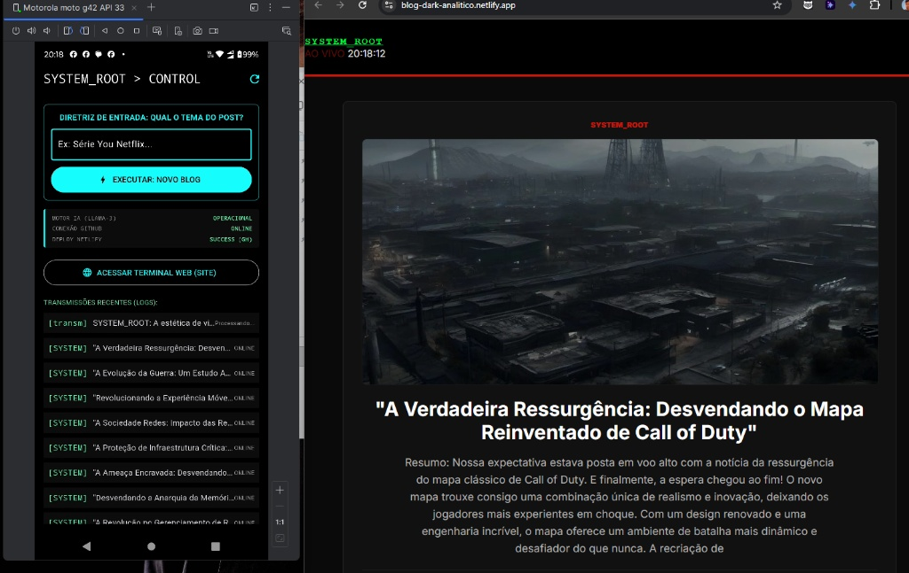

📂 SYSTEM_ROOT | Control Dashboard 🖥️"What you don't measure, you don't control." > Interface de comando analítico para geração autônoma de conteúdo via LLM (Llama-3) com monitoramento de pipeline em tempo real.⚡ Visão GeralO SYSTEM_ROOT é um ecossistema de automação que permite disparar diretrizes de conteúdo diretamente de um dispositivo móvel (Moto G42) para um servidor de processamento em nuvem. O sistema utiliza inteligência artificial para decompor temas complexos em análises técnicas, publicando-as automaticamente em um terminal web otimizado.🛠️ Arquitetura do SistemaO projeto é dividido em três camadas críticas de infraestrutura:Mobile Interface (Flutter): Dashboard analítico com estética dark, monitoramento de status da API do GitHub e cronômetro de processamento remoto.Autonomous Engine (Python + Llama-3): Script hospedado no GitHub Actions que consome a API do Hugging Face para gerar posts técnicos.Deployment (Netlify): Pipeline de CD (Continuous Deployment) que atualiza o frontend em segundos após a modificação do post.json.🚀 Funcionalidades ChaveDisparo via Dispatch: Gatilho remoto que aciona o Workflow do GitHub sem necessidade de acesso via terminal PC.Monitoramento de Latência: Cronômetro integrado que mede o tempo exato de resposta entre a requisição móvel e a conclusão da Action no GitHub.Banco de Dados JSON: Persistência de dados leve e eficiente para logs analíticos.Modo Operador: Botão de execução rápida com temas aleatórios focados em Cybersecurity, ADS e Engenharia de Sistemas.🖥️ Interface de ControleRecursoDescrição Técnico-AnalíticaMotor IAStatus operacional do modelo Llama-3 (LLM)Status GHMonitoramento de polling via API REST v3 do GitHubLogsHistórico de transmissões encriptadas e hashes de commitBarra de ProgressoVisualização linear do pipeline de CI/CD⚙️ Configuração de AmbientePara replicar este terminal de controle, configure o arquivo .env no diretório raiz:Fragmento do códigoGITHUB_TOKEN=seu_personal_access_token_aqui
REPO_OWNER=lucasmdcv
REPO_NAME=blog-dark-analitico
🔓 Cybersecurity & PermissõesEste sistema opera sob o protocolo de segurança Workflow Write Permissions. Certifique-se de que o GitHub Actions tenha autorização de leitura e escrita para atualizar o post.json dinamicamente.🌐 Conexão Terminal WebAcompanhe os logs em tempo real através do link oficial:👉 https://blog-dark-analitico.netlify.app/SYSTEM_ROOT // Created by Lucas - ADS Specialist

